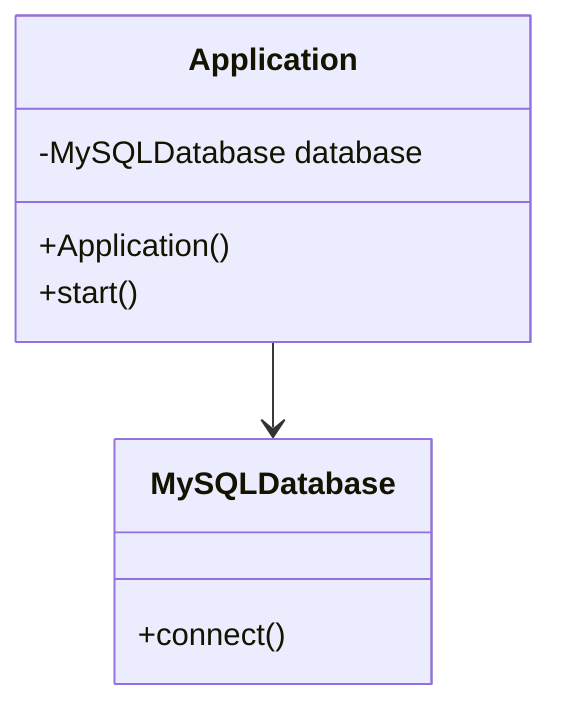
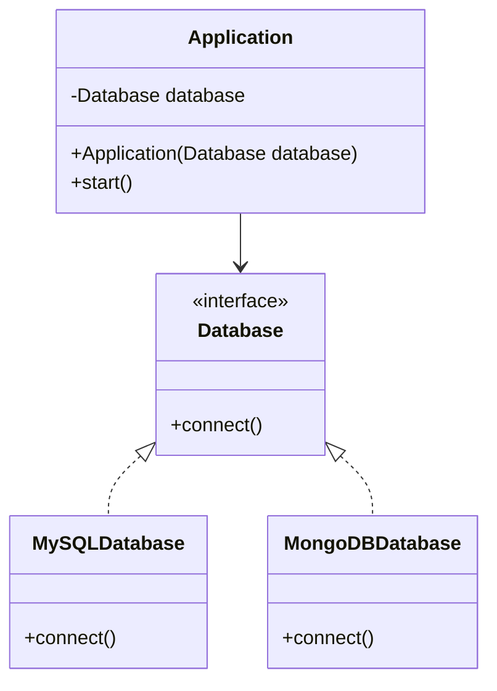

# Dependency Inversion Principle

## Without DIP
The `Application` class is tightly coupled to the `MySQLDatabase` class, making it hard to change or extend without modifying `Application`:

### Explanation of the Diagram:
1. **`MySQLDatabase` Class**:
   - Provides the `connect` method to establish a connection to the MySQL database.

2. **`Application` Class**:
   - Directly creates an instance of `MySQLDatabase` in its constructor.
   - Relies on `MySQLDatabase` for its functionality, violating the Dependency Inversion Principle.

3. **Relationship**:
   - The `Application` class has a direct dependency (`-->`) on `MySQLDatabase`.

### Why It Violates DIP:
- The **high-level module** (`Application`) is **dependent on a low-level module** (`MySQLDatabase`), which violates DIP.
- If you wanted to switch from MySQL to MongoDB or any other database, you would need to modify the `Application` class.
- This creates tight coupling, which makes the system difficult to maintain, extend, and test.

### How to Correct It (Adhering to DIP):
- You can abstract the database connection using an interface (`Database`), and inject the database type into the `Application` class, making it flexible to switch between different database implementations.
## With DIP
The provided code, which follows the **Dependency Inversion Principle (DIP)** by depending on an abstraction (`Database`) instead of concrete implementations (`MySQLDatabase` and `MongoDBDatabase`).

### Explanation of the Diagram:
1. **`Database` Interface**:
   - Defines the `connect` method as the abstraction for database connectivity.

2. **`MySQLDatabase` and `MongoDBDatabase` Classes**:
   - Implement (`<|..`) the `Database` interface.
   - Provide specific implementations for the `connect` method.

3. **`Application` Class**:
   - Depends on the `Database` interface rather than concrete database classes.
   - The database type is injected via the constructor (`Application(Database database)`), ensuring flexibility and adherence to DIP.

4. **Relationships**:
   - `MySQLDatabase` and `MongoDBDatabase` implement (`<|..`) the `Database` interface.
   - `Application` depends (`-->`) on the `Database` interface.

### How It Follows DIP:
- **High-level module (`Application`)**: Relies on the `Database` abstraction, not on specific implementations.
- **Low-level modules (`MySQLDatabase`, `MongoDBDatabase`)**: Implement the `Database` interface, enabling `Application` to remain independent of the database type.

This approach makes the system modular, testable, and adaptable to changes, such as adding new database types without modifying the `Application` class.