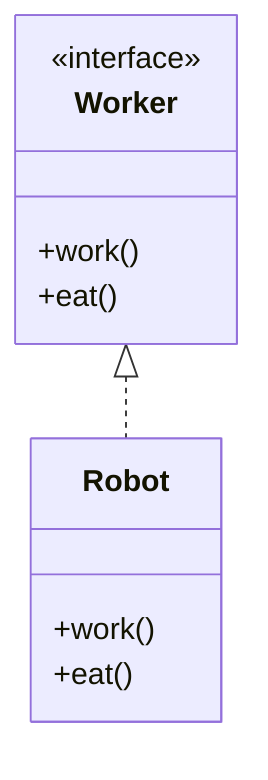
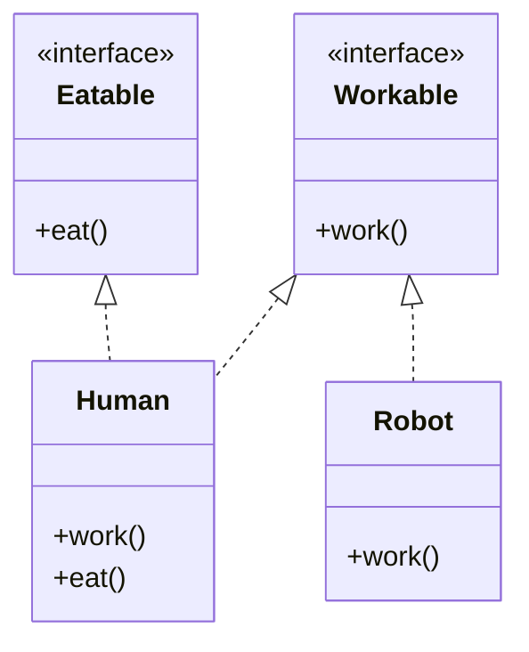

# Interface Segregation Principle

## Without ISP

### Explanation of the Diagram:
1. **`Worker` Interface**:
   - Declares two methods: `work` and `eat`.

2. **`Robot` Class**:
   - Implements the `Worker` interface.
   - Properly implements the `work` method but fails with `eat`, as robots cannot eat.
   - To comply with the interface, `Robot` provides an unsupported implementation for `eat`, violating ISP.

3. **Relationship**:
   - The `Robot` class implements (`<|..`) the `Worker` interface, leading to a design flaw where `Robot` is burdened with responsibilities it cannot fulfill.

This design demonstrates why **ISP** recommends splitting the interface into smaller, focused ones to avoid forcing implementations of irrelevant methods.

## With ISP

### Explanation of the Diagram:
1. **`Workable` Interface**:
   - Defines the `work` method, representing entities that can perform work.

2. **`Eatable` Interface**:
   - Defines the `eat` method, representing entities that can eat.

3. **`Human` Class**:
   - Implements both `Workable` and `Eatable` interfaces because humans can work and eat.
   - Provides its own implementation for both `work` and `eat`.

4. **`Robot` Class**:
   - Implements only the `Workable` interface because robots can work but do not eat.

5. **Relationships**:
   - `Human` implements (`<|..`) both `Workable` and `Eatable` interfaces.
   - `Robot` implements only the `Workable` interface, demonstrating compliance with ISP.

This design ensures that:
- Classes only implement the methods they need.
- Interfaces are cohesive and focused on specific functionalities, avoiding unnecessary obligations.