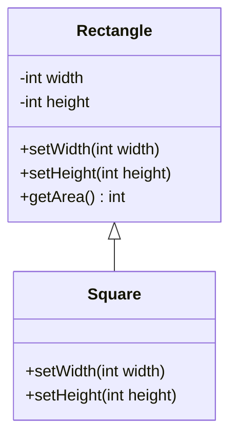
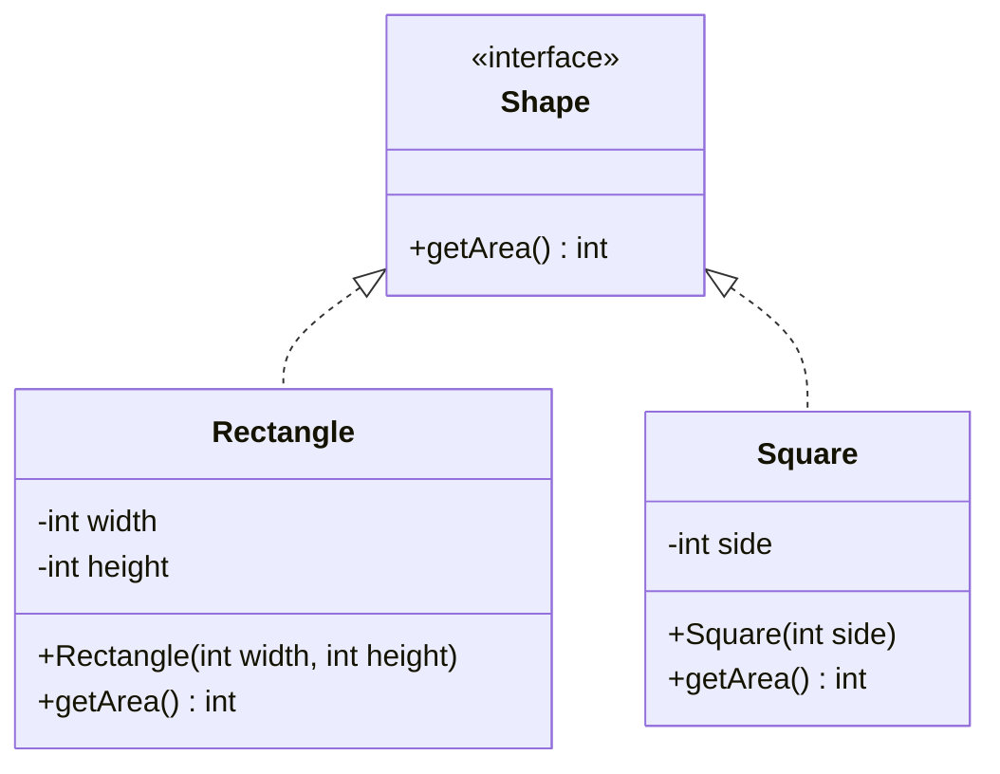

### **Liskov Substitution Principle (LSP)**.

#### Without LSP

### Explanation of the Diagram:
1. **`Rectangle`**:
   - Contains protected fields `width` and `height`.
   - Provides methods `setWidth`, `setHeight`, and `getArea`.

2. **`Square`**:
   - Inherits from `Rectangle` but overrides `setWidth` and `setHeight` to enforce the square's side equality.
   - This override introduces behavior inconsistent with the base class (`Rectangle`), violating LSP.

3. **Relationship**:
   - The `Square` class inherits (`<|--`) from the `Rectangle` class, showcasing the problematic design leading to LSP violation.
---
#### With LSP

### Explanation of the Diagram:
1. **`Shape` Interface**:
   - Declares the `getArea` method, providing a common contract for all shapes.

2. **`Rectangle` Class**:
   - Implements `Shape` and provides a constructor to initialize `width` and `height`.
   - Implements `getArea` to calculate the area of the rectangle.

3. **`Square` Class**:
   - Implements `Shape` and provides a constructor to initialize the `side`.
   - Implements `getArea` to calculate the area of the square.

4. **Relationships**:
   - Both `Rectangle` and `Square` implement (`<|..`) the `Shape` interface, ensuring that the LSP is maintained.
   - Both can be used interchangeably via the `Shape` interface without breaking the behavior of the program.