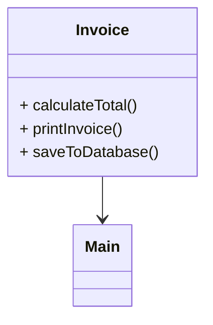
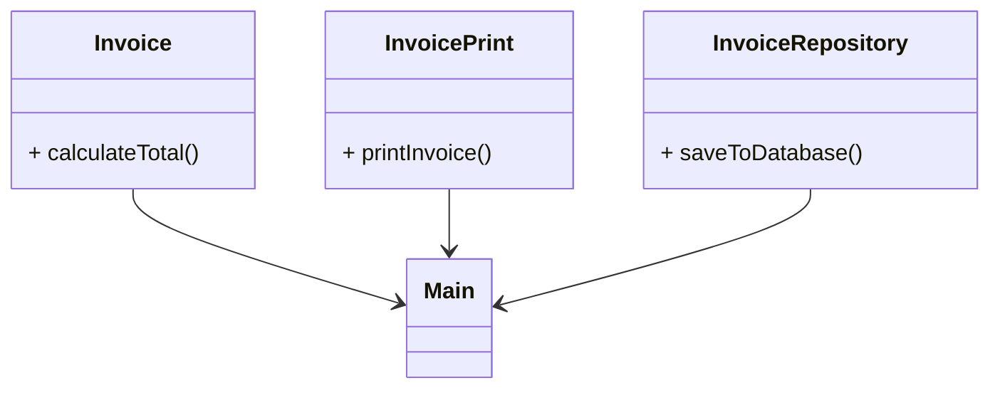

# SOLID-Principles
The **SOLID principles** are five fundamental design principles in object-oriented programming that help developers create scalable, maintainable, and testable software. Each principle tackles common issues encountered in software design.

#### Why SOLID Principles Are Important
**Maintainability**: Easier to modify code without introducing bugs.
**Scalability**: Simplifies adding new features.
**Testability**: Improves the ability to write unit tests.
**Readability**: Makes the code more understandable for developers

### 1. Single Responsibility Principle (SRP)
`A class should have only one reason to change, meaning it should only have one job or responsibility.`

**Why it is important:**
When a class has multiple responsibilities, changes to one responsibility can inadvertently impact the other, leading to bugs and harder maintenance.

- Violates SRP: 

- With SRP:

### 2. Open/Closed Principle (OCP)
`A class should be open for extension but closed for modification.`

**Why it is important:**
You can add new functionality without altering existing code, minimizing the risk of introducing bugs.

- Without OCP
- With OCP

### 3. Liskov Substitution Principle (LSP)
`Derived classes should be substitutable for their base classes without altering the correctness of the program.`

**Why it is important:**
Ensures polymorphism works correctly, and derived classes don’t break the functionality expected from the base class.

- Without LSP
- With LSP
  
### 4. Interface Segregation Principle (ISP)
`A class should not be forced to implement interfaces it does not use.`

**Why it is important:**
Prevents creating large, unwieldy interfaces that force classes to implement unnecessary methods.

- Without ISP
- With ISP

### 5. Dependency Inversion Principle (DIP)
`High-level modules should not depend on low-level modules. Both should depend on abstractions.`

**Why it is important:**
Reduces coupling and makes code easier to test and modify.

- Without DIP
- With DIP